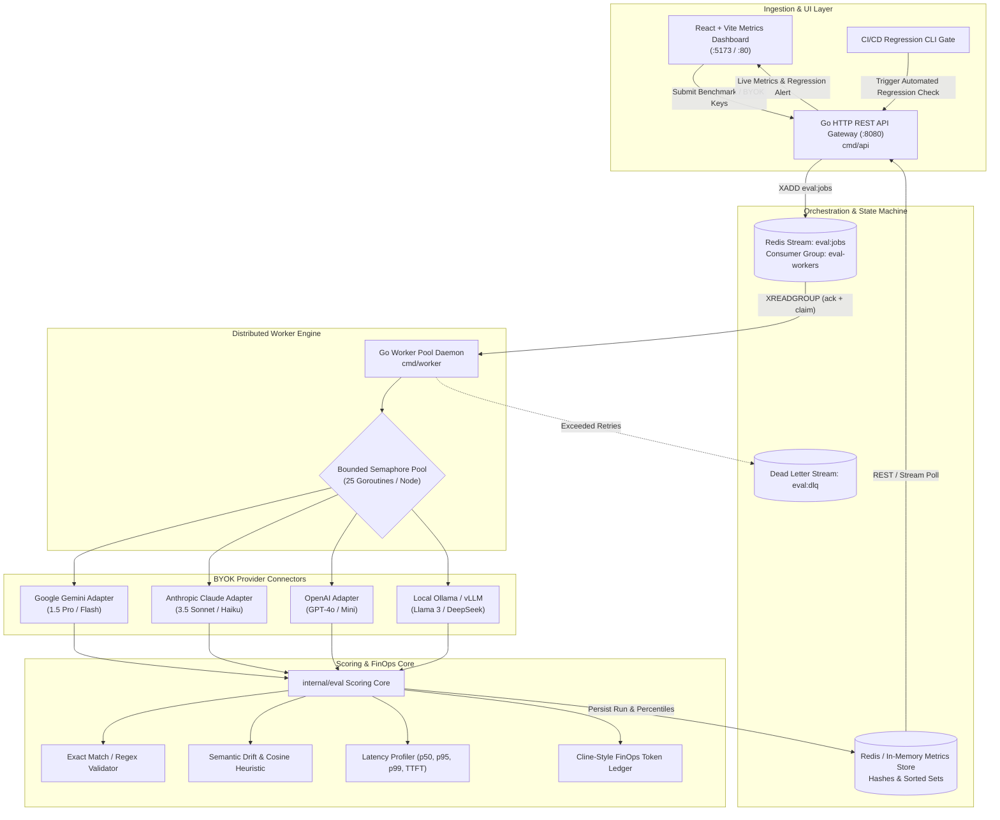

<div align="center">

# EvalPulse ⚡
### Distributed Multi-Model LLM Evaluation & Regression Pipeline
**Continuous Benchmarking, Semantic Regression Gates, and Cline-Style Bring-Your-Own-Account (BYOK) FinOps**

[](https://go.dev/)
[](https://redis.io/)
[](https://reactjs.org/)
[](https://tailwindcss.com/)
[](LICENSE)
[](docs/pm/PROJECT_CHARTER.md)
[](docs/api/openapi.yaml)

</div>

---

## 1. Executive Summary

Production AI systems built on Large Language Models face an acute operational paradox: foundational models advance at breakneck speed, yet **silent model regressions, non-deterministic drift, unmonitored latency spikes, and runaway API token costs** routinely slip past standard unit tests into production.

Furthermore, traditional LLM evaluation platforms impose severe business frictions:
- **Proprietary SaaS Markup:** Intermediary vendors apply steep 300%–500% surcharges on top of raw API token consumption.
- **Credential Exfiltration:** Storing enterprise API credentials on third-party cloud brokers violates strict enterprise compliance (SOC 2, ISO 27001).

**EvalPulse** resolves this fundamental engineering bottleneck. Inspired by the frictionless developer-first market model of **Cline**, EvalPulse implements a strict **Bring-Your-Own-Account (BYOA / BYOK)** architecture. Developers and platform teams directly connect their existing provider credentials (Google Gemini, Anthropic Claude, OpenAI, and local Ollama/vLLM) to a distributed, concurrent Go worker pool coordinated via **Redis Streams**.

EvalPulse guarantees:
1. **Automated CI/CD Regression Gates:** Quantitative blocking of code merges if semantic drift drops $> 5\%$.
2. **Sub-5-Second Multi-Model Parallel Delta:** High-concurrency goroutine fan-out with bounded backpressure.
3. **Zero-Markup FinOps Transparency:** Sub-cent billing attribution and real-time token telemetry straight from official provider rate cards.
4. **Zero Credential Exfiltration:** Ephemeral in-memory execution; keys are never persisted in external telemetry servers.

---

## 2. Distributed Architecture & Data Flow



---

## 3. Project Management & Governance Suite

EvalPulse was architected under the **Google Technical Project Management (TPM) and Agile framework**, incorporating complete engineering governance:

| Governance Document | Focus & Description |
| :--- | :--- |
| 📋 [**Project Charter**](docs/pm/PROJECT_CHARTER.md) | Business justification, Executive OKRs (KR1: sub-5s parallel delta; KR2: >5% regression catch; KR3: 500 concurrent evals), and scope boundaries. |
| 🛡️ [**Risk Register**](docs/pm/RISK_REGISTER.md) | Quantitative risk scoring ($5 \times 5$ matrix), deep-dive mitigation for API rate limits (`RSK-001`), budget hard-caps (`RSK-002`), and worker starvation (`RSK-003`). |
| 👥 [**RACI Matrix**](docs/pm/RACI_MATRIX.md) | Cross-functional accountability matrix spanning TPM, Principal Architect, Go Backend, React Frontend, and Agent Pods with formal conflict escalation tiers. |
| 🚀 [**Release Delivery Plan**](docs/pm/RELEASE_PLAN.md) | 3-Sprint Agile delivery milestones (Sprint 1 Alpha, Sprint 2 Beta, Sprint 3 v1.0 GA), quantitative quality exit gates, SLAs, and rollback runbooks. |
| 🏛️ [**Software Design Description (SDD)**](docs/architecture/SDD.md) | Comprehensive engineering specification, sequence diagrams, bounded concurrency profiles, memory boundaries (<150MB RSS), and Redis storage layout. |
| 📜 [**ADR 0001: Redis Streams vs Kafka**](docs/architecture/adr/0001-redis-streams-vs-kafka-for-job-orchestration.md) | Architectural decision record detailing why Redis Streams was selected over Kafka and RabbitMQ. |
| 📜 [**ADR 0002: Go Concurrency Patterns**](docs/architecture/adr/0002-go-concurrency-patterns-for-eval-workers.md) | Architectural evaluation of bounded semaphore channels vs unbounded goroutines for rate-sensitive LLM workers. |
| 🌐 [**OpenAPI 3.0 Specification**](docs/api/openapi.yaml) | Full REST contract for evaluation jobs, metric queries, provider validation, and regression gates. |

---

## 4. Repository Structure

```text
eval-pulse/
├── .github/
│   ├── ISSUE_TEMPLATE/
│   │   ├── bug_report.md
│   │   └── user_story.md
│   └── workflows/
│       ├── test-go.yml
│       └── build-ui.yml
├── docs/
│   ├── pm/
│   │   ├── PROJECT_CHARTER.md
│   │   ├── RACI_MATRIX.md
│   │   ├── RISK_REGISTER.md
│   │   └── RELEASE_PLAN.md
│   ├── architecture/
│   │   ├── SDD.md
│   │   └── adr/
│   │       ├── 0001-redis-streams-vs-kafka-for-job-orchestration.md
│   │       └── 0002-go-concurrency-patterns-for-eval-workers.md
│   └── api/
│       └── openapi.yaml
├── cmd/
│   ├── api/
│   │   └── main.go          # High-throughput HTTP REST API Gateway
│   └── worker/
│       └── main.go          # Distributed Redis Stream consumer & worker engine
├── internal/
│   ├── config/              # Environment variable configurations
│   ├── eval/                # Scoring heuristics (Exact match, Cosine similarity, FinOps ledger)
│   ├── models/              # Multi-provider adapters (Gemini, OpenAI, Anthropic, Ollama, Mock)
│   ├── queue/               # Redis Stream producer & consumer group wrapper
│   └── storage/             # Redis / In-memory persistent metric store
├── web/                     # React + Vite + Tailwind CSS metrics dashboard
│   ├── src/
│   │   ├── components/      # FinOps Bar, Latency Chart, Comparison Cards, BYOK Modal
│   │   ├── App.jsx          # Real-time state coordination
│   │   └── index.css
│   ├── package.json
│   ├── vite.config.js
│   └── Dockerfile
├── Dockerfile.api           # Multi-stage alpine Go API container
├── Dockerfile.worker        # Multi-stage alpine Go Worker container
├── docker-compose.yml       # Production stack: API, Workers, Redis, UI
├── Makefile                 # Developer lifecycle commands
├── go.mod
├── go.sum
└── README.md
```

---

## 5. Quickstart & Deployment

### Option A: Complete Docker Compose Stack (Recommended)
Launch the API gateway, distributed worker nodes, Redis 7.2 Streams, and the React metrics UI with a single command:

```bash
docker compose up --build -d
```

- **Dashboard UI:** [http://localhost:5173](http://localhost:5173)
- **API Gateway:** [http://localhost:8080](http://localhost:8080)
- **Health Check:** `curl http://localhost:8080/healthz`

### Option B: Local Standalone Development

#### 1. Start Go REST API Gateway
```bash
go run ./cmd/api
```

#### 2. Start Distributed Worker Pool Daemon
```bash
go run ./cmd/worker
```

#### 3. Launch React Dashboard
```bash
cd web
npm install
npm run dev
```

---

## 6. CI/CD Automated Regression Quality Gate

EvalPulse includes an automated regression gate endpoint designed to block pull requests in GitHub Actions or GitLab CI when model drift occurs:

```bash
curl -f "http://localhost:8080/api/v1/metrics/regression-check?threshold_percent=5.0"
```

**Output when passing:**
```json
{
  "passed": true,
  "exit_code": 0,
  "threshold_percent": 5.0,
  "max_observed_drift_percent": 1.8,
  "failing_models": [],
  "message": "All models meet baseline standards. No regression detected."
}
```

If a candidate model degrades by more than 5.0%, the endpoint returns `HTTP 409 Conflict` with `exit_code: 1`, immediately halting the deployment pipeline.

---

## 7. Cline-Style BYOK Pricing Matrix

EvalPulse calculates precise sub-cent token spend using official provider rate cards:

| Provider / Model | Input ($ / 1M Tokens) | Output ($ / 1M Tokens) | Markup |
| :--- | :---: | :---: | :---: |
| **Google Gemini 1.5 Flash** | **\$0.075** | **\$0.30** | **0.0% (BYOK)** |
| **Google Gemini 1.5 Pro** | **\$3.50** | **\$10.50** | **0.0% (BYOK)** |
| **OpenAI GPT-4o-mini** | **\$0.15** | **\$0.60** | **0.0% (BYOK)** |
| **OpenAI GPT-4o** | **\$2.50** | **\$10.00** | **0.0% (BYOK)** |
| **Anthropic Claude 3.5 Sonnet** | **\$3.00** | **\$15.00** | **0.0% (BYOK)** |
| **Local Ollama / vLLM** | **\$0.00** | **\$0.00** | **0.0% (Self-hosted)** |

---

## 8. License

Distributed under the Apache 2.0 License. See `LICENSE` for details.
