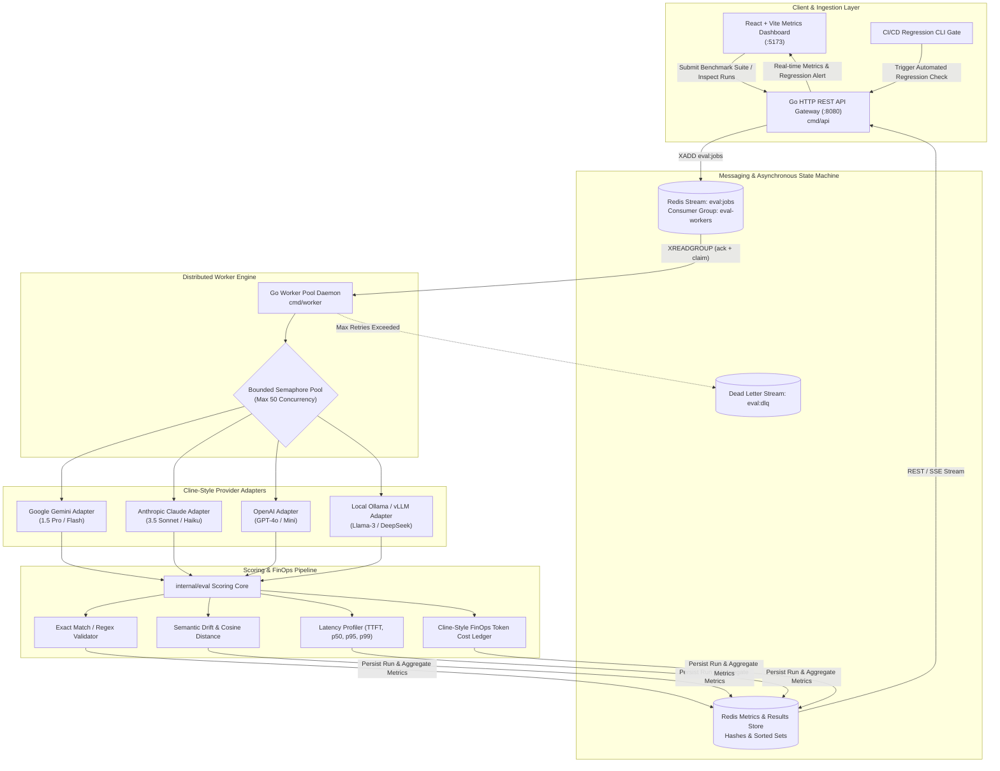
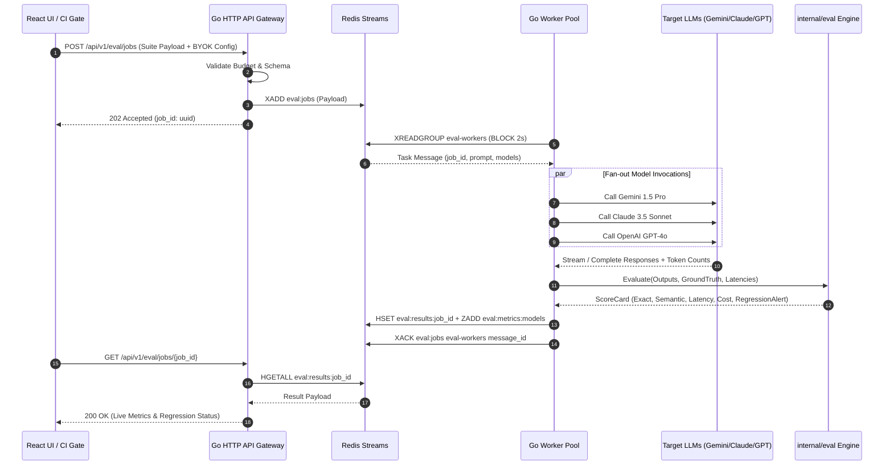

# Software Design Description (SDD): EvalPulse
## Distributed Multi-Model LLM Evaluation & Regression Pipeline

| Document Metadata | Information |
| :--- | :--- |
| **System Name** | EvalPulse Core Platform |
| **Document Version** | 1.0.0 (Approved Engineering Baseline) |
| **Author** | Principal Systems Architect |
| **Reviewed By** | Senior Technical Project Manager (TPM), Lead Distributed Systems Engineer |
| **Target Runtime** | Go 1.22+ (Worker/API), Redis 7.2+, React 18+ / Vite |
| **Status** | Active / Architecture Baseline |

---

## 1. System Overview & Problem Statement

Large Language Models behave non-deterministically. Even when temperature is pinned to zero, upstream provider quantization changes, infrastructure routing, or system prompt modifications can induce silent regression in response quality, schema compliance, latency, and token expenditure.

**EvalPulse** provides a distributed, high-concurrency evaluation state machine and regression detection engine. Adopting the **Cline-style Bring-Your-Own-Account (BYOK)** design pattern, EvalPulse enables engineers to benchmark prompts, evaluation suites, and agentic workflows directly against their existing provider accounts (Google Gemini, Anthropic Claude, OpenAI, and local Ollama/vLLM) with:
- **Zero Third-Party Billing Markup:** Costs are calculated strictly according to actual token consumption and official provider rate cards.
- **Zero Credential Exfiltration:** API keys and sensitive prompts remain securely encapsulated within private developer workstations or internal VPC boundaries.
- **High Concurrency & Resilience:** Redis Streams guarantees backpressure, consumer group distribution, and message durability, while bounded Go worker pools prevent API throttling.

---

## 2. High-Level Architecture & End-to-End Data Flow



---

## 3. Detailed Component Decomposition

### 3.1 HTTP Ingestion Gateway (`cmd/api`)
The API gateway acts as the stateless entrypoint for test execution requests and metrics querying.
- **Responsibilities:**
  - Validates evaluation suite payloads against predefined JSON schemas.
  - Implements budget pre-flight checks: aborts immediately if estimated tokens exceed user budget limits.
  - Pushes evaluation jobs onto Redis Stream `eval:jobs` with unique job and suite UUIDs.
  - Exposes query endpoints for run status, model comparison matrices, and CI/CD regression exit gates (`/api/v1/metrics/regression-check`).

### 3.2 Distributed Queue & State Machine (`internal/queue`)
Built upon Redis Streams to achieve distributed consumer group coordination without external broker bloat:
- **Stream Key:** `eval:jobs`
- **Consumer Group:** `eval-workers`
- **Consumer Identity:** Unique worker pod hostnames (`worker-01`, `worker-02`).
- **Reliability Protocol:**
  - Workers fetch tasks using `XREADGROUP GROUP eval-workers <consumer-id> COUNT 10 BLOCK 2000 STREAMS eval:jobs >`.
  - Upon successful provider execution and scoring, an explicit `XACK eval:jobs eval-workers <message-id>` is issued.
  - A background janitor thread runs `XAUTOCLAIM eval:jobs eval-workers <consumer-id> 60000 0-0` to recover abandoned jobs from crashed workers.
  - Messages exceeding 3 failed attempts are moved to the dead-letter stream `eval:dlq`.

### 3.3 Concurrent Worker Pool (`cmd/worker`)
The worker engine is engineered for massive parallel I/O while strictly respecting system memory ceilings and provider rate limits:
- **Bounded Worker Pool:** Utilizes a buffered channel semaphore (`chan struct{}`) to throttle concurrent outbound HTTP calls to a configurable maximum (e.g., 50 concurrent goroutines).
- **Fan-Out Concurrency:** For multi-model comparative benchmarking, a single incoming prompt fans out across target providers simultaneously using `sync.WaitGroup` and buffered result channels.
- **Jittered Backoff:** In the event of an upstream HTTP 429 or 503 response, the worker applies exponential backoff with full jitter to avoid stampeding herd problems.
- **Graceful Teardown:** Listens for `os.Interrupt` and `syscall.SIGTERM`. Upon receipt, stops pulling from the stream and allows active goroutines up to 30 seconds to complete and ack in-flight jobs.

### 3.4 Cline-Style BYOK Provider Adapters (`internal/models`)
Unified provider interface allowing direct communication with LLM endpoints using the developer's credentials:
```go
type Provider interface {
    Name() string
    Generate(ctx context.Context, prompt string, opts ModelOptions) (*ModelResponse, error)
    ValidateCredentials(ctx context.Context) error
}
```
- **Gemini Adapter:** Interacts with Google AI Studio / Vertex AI REST endpoints.
- **OpenAI Adapter:** Interfaces with OpenAI Chat Completions API (`v1/chat/completions`).
- **Anthropic Adapter:** Interfaces with Anthropic Messages API (`v1/messages`).
- **Ollama Adapter:** Connects to local or remote Ollama instances (`/api/generate`) with zero cloud egress.

### 3.5 Scoring & Heuristics Core (`internal/eval`)
The evaluation engine runs multi-metric scoring across the generated model outputs:
1. **Exact Match & Schema Conformance:** String normalization, case-insensitive comparison, and JSON schema validation.
2. **Semantic Similarity & Drift:** Computes token-level cosine similarity against reference baselines. Flags semantic degradation if score drops below baseline by more than 5%.
3. **Latency Profiling:** Measures Time-To-First-Token (TTFT) and total latency; updates rolling p50, p95, and p99 percentiles.
4. **Cline-Style FinOps Ledger:** Tallies input and output tokens; applies rate cards to calculate exact sub-cent costs per provider.

### 3.6 Real-Time Dashboard UI (`web/`)
A responsive React + Vite + Tailwind CSS dashboard providing instant developer visibility:
- **Provider Account Modal:** Allows users to input and securely test their API keys.
- **Comparison Grid:** Side-by-side performance cards for each model showing average latency, cost, and drift score.
- **Latency Distribution Curves:** Recharts visualizations of p50, p95, and p99 percentiles.
- **Live Run Inspector:** Real-time log table showing prompt previews, winning models, and regression alerts.

---

## 4. End-to-End Sequence Diagram



---

## 5. Non-Functional Requirements & Performance Envelopes

### 5.1 Concurrency & Resource Boundaries
- **Memory Footprint:** Each worker process must maintain an RSS memory footprint of **< 150 MB** under steady-state load of 50 concurrent active requests.
- **Goroutine Leak Prevention:** All asynchronous workers utilize strict parent context propagation (`context.WithTimeout`). No goroutine is spawned without explicit termination bounds via worker pool semaphores.
- **Graceful Shutdown:** The worker traps `SIGINT` and `SIGTERM`, canceling the stream polling context while allowing up to 30 seconds for in-flight jobs to complete and ack.

### 5.2 Latency & Performance SLAs
- **Worker Dispatch Overhead:** < 5 milliseconds from Redis stream dequeue to provider HTTP dispatch.
- **API Response Time:** < 20 milliseconds for job submission and status check endpoints.
- **Dashboard Refresh Interval:** Sub-100 millisecond UI state re-renders using optimized React hooks.

---

## 6. Data Schema & Redis Storage Layout

| Redis Key Pattern | Data Structure | Purpose / Content | TTL |
| :--- | :--- | :--- | :--- |
| `eval:jobs` | Stream (`XADD`) | Asynchronous job dispatch stream with consumer groups | 7 Days |
| `eval:dlq` | Stream (`XADD`) | Dead-letter stream for poison pills / failed tasks | 30 Days |
| `eval:runs:{run_id}` | Hash (`HSET`) | Metadata for a complete evaluation suite run | 30 Days |
| `eval:results:{job_id}` | Hash (`HSET`) | Detailed per-model response, latency, tokens, cost, and scores | 30 Days |
| `eval:metrics:{model}:latency` | Sorted Set (`ZADD`) | Ordered latencies for percentile calculation (p50, p95, p99) | 14 Days |
| `eval:metrics:{model}:cost` | String / Counter | Cumulative USD spend per provider | Permanent |
