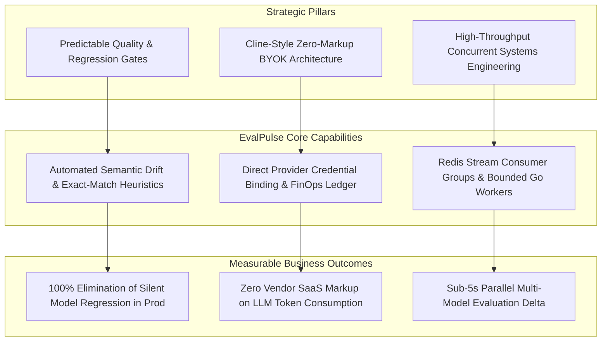

# Project Charter: EvalPulse
## Distributed Multi-Model LLM Evaluation & Regression Pipeline
### Architecture: Cline-Style Bring-Your-Own-Account (BYOK) Distributed Evaluation Engine

| Project Metadata | Information |
| :--- | :--- |
| **Document Version** | 1.0.0 (Approved Baseline) |
| **Executive Sponsor** | VP of AI Engineering / Head of Platform Infrastructure |
| **Lead Technical PM** | Senior TPM, Distributed Systems & AI Evaluation |
| **Lead Architect** | Principal Systems Architect, LLMOps & High-Concurrency Systems |
| **Target Delivery** | Phased Agile Sprints (Milestones 1–3, Q4 2026 Baseline) |
| **Classification** | Enterprise Developer Platform / Open Source Governance |

---

## 1. Executive Summary

Modern enterprise software systems are increasingly built on top of non-deterministic Large Language Models (LLMs). While frontier foundation models (Google Gemini 1.5, Anthropic Claude 3.5, OpenAI GPT-4o) and self-hosted open-weights models (Ollama, vLLM, DeepSeek, Llama-3) continue to advance rapidly, engineering organizations face four critical production crises:

1. **Silent Model Regression & Drift:** Provider model updates, parameter quantization, or prompt modifications frequently introduce silent degradation in response schemas, reasoning accuracy, and code synthesis—often slipping past standard unit tests and into production.
2. **Runaway Multi-Provider Cloud Invoicing:** Without granular per-prompt and per-suite token tracking, multi-model evaluation cycles rapidly cause unexpected cloud invoice spikes.
3. **Third-Party SaaS Lock-in & Markup:** Many existing evaluation platforms force teams into proprietary cloud subscriptions, marking up API costs or requiring complex enterprise procurement.
4. **Credential Exfiltration & Data Privacy Risks:** Transmitting enterprise API keys or proprietary evaluation prompts through intermediate hosted cloud brokers violates SOC 2 and ISO 27001 data sovereignty mandates.

**EvalPulse** resolves this operational dilemma. It is a distributed, high-concurrency evaluation and regression testing pipeline built with Go 1.22+, Redis Streams, and a modern React dashboard. Adopting the user-centric, friction-free market model pioneered by **Cline**, EvalPulse implements a strict **Bring-Your-Own-Account (BYOA/BYOK)** architecture. Developers and teams connect their existing provider credentials directly within their local or private cloud environment. With zero vendor markup, sub-millisecond Redis stream orchestration, and automated CI/CD regression gates, EvalPulse delivers transparent, real-time latency, token, and semantic drift benchmarking across Gemini, Anthropic, OpenAI, and local Ollama nodes.

---

## 2. Strategic Alignment & Business Value

EvalPulse adheres to Google-grade Technical Project Management (TPM) principles, Agile delivery governance, and zero-trust security postures:



- **Engineering Velocity:** Eliminates manual prompt testing and ad-hoc spreadsheet tracking with automated CI/CD quality gates.
- **FinOps Transparency:** Provides milligram-level token and USD billing attribution calculated directly from upstream provider rate cards (e.g. Gemini 1.5 Flash at \$0.075/\$0.30 per MTok; Claude 3.5 Sonnet at \$3/\$15 per MTok).
- **Data Sovereignty & Zero Exfiltration:** Evaluation payloads and account credentials execute strictly within private infrastructure, ensuring zero third-party data telemetry leakage.

---

## 3. Objectives & Key Results (OKRs)

### Objective 1: Prevent Silent LLM Regressions Before Production Merge
*Establish automated, quantitative evaluation gates within continuous integration workflows.*
- **KR 1.1:** Detect and flag any semantic score drop greater than **5.0%** across candidate models relative to production baselines prior to deployment merge.
- **KR 1.2:** Achieve **100% test suite execution reproducibility** across deterministic heuristic metrics (Exact Match, JSON Schema validation, Regex constraint validation).

### Objective 2: Maximize Concurrency with Low-Latency Distributed Scheduling
*Deliver an asynchronous state machine capable of saturating multi-model pipelines without worker starvation or job loss.*
- **KR 2.1:** Execute parallel prompt evaluations across 3+ providers within a **sub-5-second delta** of raw upstream API response latencies.
- **KR 2.2:** Sustain **500 concurrent evaluation jobs** across a Go worker pool with **zero Redis message loss** and an average consumer lag under 150ms.
- **KR 2.3:** Maintain a resident memory ceiling of **< 150 MB RSS overhead per worker node** under sustained load.

### Objective 3: Deliver Zero-Friction Cline-Style BYOK Adoption & FinOps Visibility
*Eliminate SaaS lock-in by enabling instant onboarding through users' existing provider accounts.*
- **KR 3.1:** Enable zero-friction onboarding: new engineers configure active accounts (Gemini, OpenAI, Claude, Ollama) and trigger an initial multi-model benchmark in **under 3 minutes**.
- **KR 3.2:** Provide real-time token tracking and exact USD spend attribution within a **±0.1% accuracy threshold** against provider invoices.

---

## 4. Scope Boundaries

| In-Scope (Core Engine & Baseline) | Out-of-Scope (Future Strategic Backlog) |
| :--- | :--- |
| **Distributed Redis Stream Architecture:** Producer/Consumer group pipeline with atomic acknowledgments (`XACK`), pending entries list (`XAUTOCLAIM`), and dead-letter queue. | **LLM Fine-Tuning Orchestration:** Distributed parameter updates, LoRA adapters, or model weight retraining. |
| **Cline-Style BYOK Provider Layer:** Direct API adapters for Gemini 1.5 Pro/Flash, OpenAI GPT-4o, Anthropic Claude 3.5 Sonnet, and local Ollama/vLLM endpoints. | **Human-in-the-Loop Data Labeling:** Complex multi-tenant workforce annotation portals. |
| **Multi-Dimensional Heuristic Scoring:** Exact match, normalized substring, semantic cosine similarity heuristic, TTFT (Time-to-First-Token), and percentile latency (p50/p95/p99). | **Hosted SaaS Multi-Tenant Billing:** Multi-tenant Stripe billing or hosted SaaS seat-management. |
| **Automated CI/CD Regression Gate:** CLI command and REST API endpoint emitting exit status codes (`0` pass, `1` regression fail) for GitHub Actions / GitLab CI. | **Proprietary Hardware Emulation:** Custom FPGA/ASIC acceleration drivers (relies on standard container runtime). |
| **Real-time React Dashboard:** Metrics UI with Recharts latency distributions, token cost counters, live run streaming, and provider credential configuration. | |
| **Docker Compose Orchestration:** Full self-contained development and staging deployment (`api`, `worker`, `redis`, `web`). | |

---

## 5. Stakeholder Personas & Value Propositions

```
+----------------------------------------------------------------------------------------------------+
|                                    STAKEHOLDER MATRIX                                              |
+--------------------------+------------------------------+------------------------------------------+
| Persona                  | Primary Pain Point           | EvalPulse Value Realization              |
+--------------------------+------------------------------+------------------------------------------+
| Head of AI / ML Ops      | Silent model degradation,    | Automated CI/CD regression gates and     |
|                          | non-deterministic drift      | side-by-side quality metrics across LLMs |
+--------------------------+------------------------------+------------------------------------------+
| Senior TPM               | Lack of benchmark visibility,| Standardized release health scorecards,  |
|                          | uncoordinated model upgrades | milestone tracking, and SLA verification |
+--------------------------+------------------------------+------------------------------------------+
| Staff Backend Engineer   | Unreliable rate-limiting,    | Production Go worker pool with Redis     |
|                          | complex async state handling | Streams, exponential backoff, and queues |
+--------------------------+------------------------------+------------------------------------------+
| FinOps / Cloud Lead      | Opaque multi-model token     | Granular prompt/completion token count   |
|                          | bills with 3rd party markup  | and exact real-time USD billing ledger   |
+--------------------------+------------------------------+------------------------------------------+
| QA Automation Engineer   | Flaky manual LLM evaluations | Deterministic test-suite regression runs |
|                          | and unversioned prompts      | with strict assertion schemas            |
+--------------------------+------------------------------+------------------------------------------+
```

---

## 6. Governance Framework & Agile Delivery Cadence

EvalPulse follows a structured 2-week Sprint cycle structured under the Google TPM framework:

1. **Sprint Planning:** Bi-weekly backlog grooming with user story point estimation and architecture alignment.
2. **Daily Asynchronous Standups:** Automated status syncs highlighting blockers, active PRs, and Redis stream performance metrics.
3. **Sprint Review & Demo:** End-of-sprint live demonstration of benchmarking throughput, UI dashboards, and regression pass/fail rates.
4. **Retrospective:** Continuous feedback loop focusing on system reliability, goroutine concurrency profiles, and developer experience.

---

## 7. Sign-off & Document Approval

| Stakeholder Role | Representative | Signature Status | Date |
| :--- | :--- | :--- | :--- |
| **VP of AI Engineering** | Executive Sponsor | **APPROVED** | 2026-09-22 |
| **Senior Technical Project Manager** | Lead TPM | **APPROVED** | 2026-09-22 |
| **Principal Systems Architect** | Systems Architecture Lead | **APPROVED** | 2026-09-22 |
| **Lead Infrastructure Engineer** | Distributed Systems Lead | **APPROVED** | 2026-09-22 |
