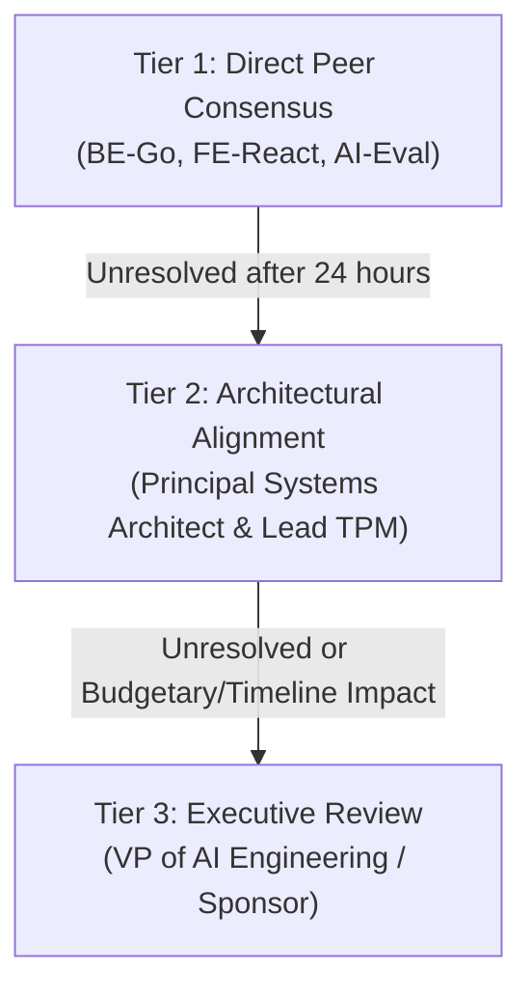

# RACI Governance Matrix: EvalPulse

| Document Metadata | Information |
| :--- | :--- |
| **Project** | EvalPulse: Distributed Multi-Model LLM Evaluation & Regression Pipeline |
| **Document Version** | 1.0.0 (Approved Baseline) |
| **Governance Owner** | Senior Technical Project Manager (TPM) |
| **Technical Reviewer** | Principal Systems Architect |
| **Last Updated** | 2026-09-22 |
| **Status** | Active / Baseline Approved |

---

## 1. RACI Definitions & Operating Principles

The RACI framework establishes clear single-threaded accountability and eliminates role ambiguity across engineering, product management, and operational workflows:

- **Responsible (R):** The executor who directly authors the code, document, or deliverable.
- **Accountable (A):** The sole individual with final veto and approval authority. Exactly **one** person is Accountable per work stream.
- **Consulted (C):** Subject matter experts whose technical opinions, review feedback, or architectural inputs are required prior to completion.
- **Informed (I):** Stakeholders kept updated on status, progress milestones, and release outcomes.

---

## 2. Stakeholder Roles & Organizational Mapping

| Role Identifier | Role Title | Functional Department | Primary Focus |
| :--- | :--- | :--- | :--- |
| **TPM** | Senior Technical Project Manager | Technical Program Management | Agile governance, schedule, OKRs, risk tracking |
| **PSA** | Principal Systems Architect | Core Architecture & Systems | Concurrency models, resilience, high-level design |
| **BE-Go** | Senior Backend Engineer (Go) | Distributed Systems Engineering | Go worker pool, Redis streams, HTTP API |
| **FE-React** | Senior Frontend Engineer | Developer Experience / UI | React dashboard, Recharts visualizations, UX |
| **AI-Eval** | AI Evaluation / ML Engineer | Applied AI & Heuristics | Semantic scoring, model drift, prompt fixtures |
| **FinOps** | FinOps & Cloud Platform Lead | Platform Operations | Token tracking, pricing models, budget caps |
| **Agent-Pod** | Antigravity Autonomous Agent Pod | Automated Agentic Engineering | Code generation, linting, test scaffolding, CI/CD |

---

## 3. Comprehensive Cross-Functional RACI Grid

| Work Stream / Project Deliverable | TPM | PSA | BE-Go | FE-React | AI-Eval | FinOps | Agent-Pod |
| :--- | :---: | :---: | :---: | :---: | :---: | :---: | :---: |
| **Project Charter & OKRs Baseline** | **A** | C | C | I | C | C | R |
| **Risk Register & Mitigation Strategy** | **A** | C | C | I | C | C | R |
| **Software Design Description (SDD)** | C | **A** | R | C | C | I | R |
| **Architecture Decision Records (ADRs)** | C | **A** | R | I | C | I | R |
| **OpenAPI 3.0 API Specification** | C | C | **A** | C | I | I | R |
| **Redis Streams Consumer Group Engine** | I | C | **A** | I | I | I | R |
| **Bounded Go Worker Pool & Jitter Logic** | I | C | **A** | I | I | I | R |
| **Cline-Style BYOK Provider Adapters** | I | C | **A** | C | C | I | R |
| **Multi-Dimensional Scoring Pipeline** | I | C | C | I | **A** | I | R |
| **Token Tracking & FinOps Ledger Engine**| C | I | C | I | I | **A** | R |
| **React Metrics & Latency Dashboard** | I | I | C | **A** | I | I | R |
| **Cline-Style BYOK Account UI Manager** | C | I | C | **A** | I | I | R |
| **Docker Compose Multi-Service Setup** | I | C | **A** | C | I | I | R |
| **Automated CI/CD Regression Gate** | C | C | **A** | I | C | I | R |
| **Release Readiness & Milestone Sign-off**| **A** | C | C | C | C | C | I |

---

## 4. Conflict Resolution & Decision Escalation

When architectural tradeoffs or cross-functional priorities conflict, the team adheres to the following escalation ladder:

1. **Tier 1 (Working Level):** Engineers resolve technical interface definitions within 24 hours through documented PR discussions.
2. **Tier 2 (Architectural & Delivery Level):** The Principal Systems Architect arbitrates architectural disputes, while the Lead TPM arbitrates schedule and scope tradeoffs.
3. **Tier 3 (Executive Level):** Final arbitration by Executive Sponsors if project budget or milestone commitments are materially affected.
