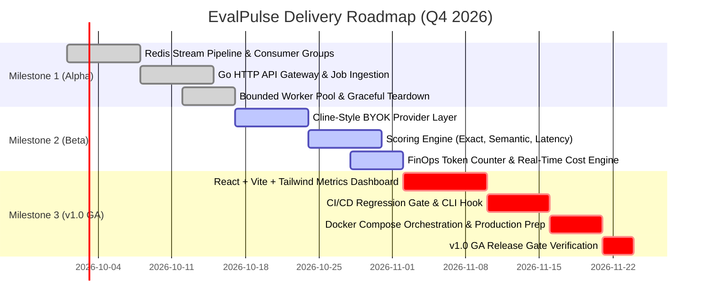
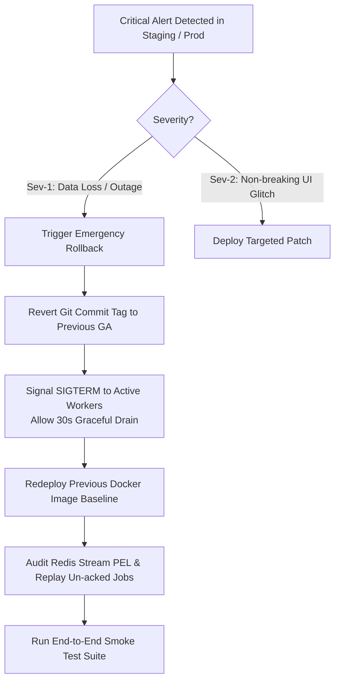

# Release Management & Delivery Plan: EvalPulse

| Document Metadata | Information |
| :--- | :--- |
| **Project** | EvalPulse: Distributed Multi-Model LLM Evaluation & Regression Pipeline |
| **Release Version** | v1.0.0 (General Availability Baseline) |
| **Release Manager** | Senior Technical Project Manager (TPM) |
| **Lead Architect** | Principal Systems Architect |
| **Release Methodology** | Phased Agile Sprints (Google TPM Framework) |
| **Status** | Active Baseline |

---

## 1. Release Roadmap & Milestones

EvalPulse follows a three-phase milestone delivery strategy designed to validate core distributed primitives before scaling into front-end visualizations and continuous regression gates:

---

## 2. Milestone Breakdown & Deliverables

### Milestone 1: Distributed Core & State Machine (Alpha Baseline)
- **Target Completion:** Sprint 1
- **Focus:** High-throughput async job queuing, state persistence, and worker pool stability.
- **Key Deliverables:**
  - Go HTTP API Gateway (`cmd/api`) supporting job dispatch (`POST /api/v1/eval/jobs`) and health checks.
  - Redis Streams integration (`internal/queue`) with consumer groups, exponential backoff, and dead-letter queue (`eval:dlq`).
  - Concurrent worker daemon (`cmd/worker`) with bounded goroutine pools and graceful teardown (`SIGINT`/`SIGTERM`).
  - In-memory mock model provider for deterministic local testing.

### Milestone 2: Multi-Model BYOK Connectors & Scoring Core (Beta Baseline)
- **Target Completion:** Sprint 2
- **Focus:** Cline-style Bring-Your-Own-Account provider integration and multi-metric heuristics.
- **Key Deliverables:**
  - Production provider adapters for Google Gemini (1.5 Pro / Flash), Anthropic (Claude 3.5 Sonnet), OpenAI (GPT-4o), and local Ollama.
  - Multi-dimensional scoring pipeline (`internal/eval`):
    - Strict Exact Match and Regex Schema Validator.
    - Token Cosine Semantic Similarity and Entity Overlap.
    - TTFT (Time-to-First-Token) and p50/p95/p99 latency percentiles.
  - Real-time FinOps pricing engine: computes exact USD costs per evaluation job based on official token rate cards.

### Milestone 3: Real-Time Metrics UI & CI Regression Gate (v1.0 GA)
- **Target Completion:** Sprint 3
- **Focus:** User interface, automated CI deployment blocking, and containerized distribution.
- **Key Deliverables:**
  - Modern React + Vite + Tailwind CSS metrics dashboard with Recharts latency curves, live run feeds, and Cline-style BYOK credential manager modal.
  - Automated CI/CD regression exit gate (`/api/v1/metrics/regression-check`) returning status 0 (pass) or 1 (regression alert).
  - Docker Compose multi-service topology (`api`, `worker`, `redis`, `web`).
  - Complete documentation suite: OpenAPI 3.0 specification, SDD, and ADR records.

---

## 3. Release Quality Gates & Exit Criteria

Every milestone must satisfy strict quantitative criteria before advancing to the next phase:

| Quality Gate Identifier | Verification Metric | Target Threshold | Validation Mechanism |
| :--- | :--- | :--- | :--- |
| **QG-01: Unit Test Coverage** | Go & React Test Line Coverage | **>= 80%** across core packages | `go test -cover` & `npm test` |
| **QG-02: Concurrency & Leak** | Goroutine Leak & Resident Memory | **0 leaks**, RSS **< 150 MB** per worker | Continuous `pprof` profile under 500 concurrent evals |
| **QG-03: Zero Job Loss** | Redis Stream Ingestion & Ack | **0 unacknowledged drops** in Redis stream | Load test injecting 5,000 tasks across consumer groups |
| **QG-04: Multi-Model Parity** | Latency Delta Across 3 Providers | **< 5.0 second delta** | Concurrent benchmark suite across Gemini, OpenAI, Claude |
| **QG-05: Regression Gate** | CI Exit Code Trigger Accuracy | **100% deterministic** on >5% score drops | Simulated regression test suite in GitHub Actions |
| **QG-06: Security Scan** | Static Code & Credential Audit | **0 High/Critical CVEs**, 0 leaked keys | GitHub CodeQL & Secret Scanner pass |

---

## 4. Service Level Agreements (SLAs) & Operational Targets

- **API Availability:** 99.9% uptime for the Go HTTP ingestion gateway.
- **Job Processing Latency:** Sub-150ms worker pickup time from stream ingestion to provider dispatch.
- **Dashboard Response Time:** Sub-100ms UI render and metric query response time.
- **Data Integrity:** 100% persistent metric recording in Redis/SQLite store with zero loss during graceful worker restarts.

---

## 5. Rollback Procedures & Contingency Runbook

In the event of a critical failure during a release deployment, operations follows this runbook:

1. **Step 1 (Signal Interruption):** Issue `SIGTERM` to the active worker container pool. Workers stop pulling new jobs and finish in-flight requests within a 30-second grace window.
2. **Step 2 (Image Rollback):** Switch container tag to previous verified release (e.g. `v0.9.4-beta`).
3. **Step 3 (Stream Stream Health Check):** Run `XPENDING eval:jobs eval-workers` in Redis to ensure no in-flight messages were orphaned.
4. **Step 4 (Post-Incident Review):** Convene a blameless post-mortem within 24 hours led by the Senior TPM and Systems Architect.
