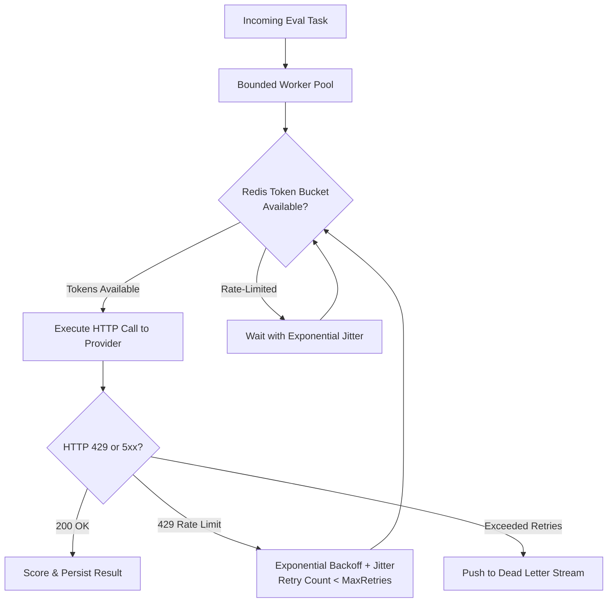

# Risk Management Register & Mitigation Strategy: EvalPulse

| Document Metadata | Information |
| :--- | :--- |
| **Project** | EvalPulse: Distributed Multi-Model LLM Evaluation & Regression Pipeline |
| **Governance Owner** | Senior Technical Project Manager (TPM) |
| **Technical Reviewer** | Principal Systems Architect |
| **Review Cadence** | Bi-Weekly Sprint Planning & Pre-Release Review |
| **Last Audit Date** | 2026-09-22 |
| **Status** | Active / Baseline Approved |

---

## 1. Risk Scoring Framework

Risks are assessed using a standard $5 \times 5$ Probability and Impact matrix yielding a composite **Risk Severity Score (1–25)**:

$$\text{Severity Score} = \text{Likelihood} \times \text{Impact}$$

- **Likelihood Levels:** 1 (Rare), 2 (Unlikely), 3 (Possible), 4 (Likely), 5 (Almost Certain)
- **Impact Levels:** 1 (Insignificant), 2 (Minor), 3 (Moderate), 4 (Major), 5 (Catastrophic)
- **Severity Classification:**
  - **High / Critical (15–25):** Immediate mitigation plan required; blocks release gates.
  - **Medium (8–14):** Active mitigation required with weekly monitoring by engineering leads.
  - **Low (1–7):** Accepted risk subject to periodic review.

---

## 2. Comprehensive Risk Matrix

| Risk ID | Category | Description | Likelihood (1-5) | Impact (1-5) | Severity (1-25) | Mitigation Strategy (Preventative) | Contingency Plan (Corrective) | Owner | Status |
| :--- | :--- | :--- | :---: | :---: | :---: | :--- | :--- | :--- | :--- |
| **RSK-001** | **Technical / API** | **Rate-Limiting & 429 Throttling:** External frontier model APIs (OpenAI, Gemini, Anthropic) enforce strict RPM/TPM rate limits, causing burst evaluations to drop or fail. | 4 | 4 | **16 (High)** | Implement client-side token-bucket rate limiters in Redis; wrap Go HTTP worker calls in exponential backoff with full jitter; inject provider rate metadata. | Trigger circuit breaker to temporarily pause worker dispatch for affected provider; failover to secondary provider or local Ollama benchmark. | Lead Backend Engineer | **Mitigated** |
| **RSK-002** | **Financial / FinOps** | **Runaway Evaluation Costs:** Automated regression suites with high token counts across multiple frontier models trigger unexpected cloud billing spikes. | 4 | 4 | **16 (High)** | Enforce strict per-suite USD budget hard-caps; SHA-256 prompt hashing and response caching; real-time Cline-style cost tracking in UI. | Abort active evaluation job when spend threshold reaches 90%; alert operator and require manual confirmation to resume. | Lead FinOps / TPM | **Mitigated** |
| **RSK-003** | **Architecture / Infra** | **Worker Starvation & Consumer Lag:** Massive evaluation batches overwhelm Redis consumer groups, leading to memory exhaustion and worker unresponsiveness. | 3 | 4 | **12 (Medium)** | Utilize bounded Go worker pools with semaphore channels; configure Redis Streams PEL (`XAUTOCLAIM`) for dead worker recovery; enforce backpressure. | Dynamically scale containerized worker replicas; reroute lagging jobs to Dead-Letter Stream (`eval:dlq`) after 3 retries. | Principal Systems Architect | **Mitigated** |
| **RSK-004** | **Data / AI Quality** | **Non-Deterministic Scoring Drift:** Inherent LLM output variability leads to false regression alerts on identical prompts. | 3 | 3 | **9 (Medium)** | Force `temperature=0.0` for regression benchmark runs; combine strict deterministic heuristics (exact match, JSON schema) with semantic cosine scoring. | Run 3-iteration bootstrap confidence sampling for ambiguous test cases before failing CI deployment gates. | AI Evaluation Lead | **Active** |
| **RSK-005** | **Security / Compliance** | **BYOK Credential Exposure:** Users' API keys for Gemini, Claude, or OpenAI stored or transmitted insecurely, risking cloud account compromise. | 2 | 5 | **10 (Medium)** | Zero-exfiltration architecture: credentials stored strictly in browser local storage or runtime memory; encrypted in transit; never written to persistent logs or database. | Immediate credential purge endpoint; support ephemeral environment variable injection in CI/CD without disk persistence. | Security Architect | **Mitigated** |
| **RSK-006** | **Runtime / Go Concurrency** | **Goroutine Leak & Memory Inflation:** Unbounded goroutine allocation or unclosed HTTP response bodies causing worker nodes to exceed the 150MB RSS limit. | 2 | 4 | **8 (Medium)** | Strict context cancellation (`context.WithTimeout`) propagated through all worker goroutines; explicit `resp.Body.Close()`; bounded worker pools. | Automated container healthchecks (`livenessProbe`) restart nodes that exceed 200MB RSS; continuous pprof memory profiling in staging. | Backend Engineer (Go) | **Mitigated** |
| **RSK-007** | **Operational / CI** | **CI/CD Pipeline Timeout:** Regression evaluation jobs taking too long, blocking pull request merges and developer velocity. | 3 | 3 | **9 (Medium)** | Tiered regression suites: Fast smoke test (top 10 critical prompts, <30s) on every PR; Full regression suite (500+ prompts) on nightly or release tag. | Asynchronous webhooks notify PR status; provide option to run fast regression suite on local Ollama instance. | Senior TPM / QA Lead | **Active** |

---

## 3. Deep-Dive Mitigation Architectures

### 3.1 Rate-Limiting & Jitter Architecture (`RSK-001`)

To prevent frontier API saturation, all outgoing worker requests pass through a coordinated rate-limiting layer:

$$\text{SleepDuration} = \min\left(T_{\max},\; T_{\text{base}} \times 2^{\text{retry}} + \text{UniformRandom}(0, \text{Jitter})\right)$$

### 3.2 Cline-Style FinOps & Budget Hard-Caps (`RSK-002`)

Before any batch evaluation suite is dispatched, EvalPulse calculates an estimated upper-bound cost based on prompt token count and target provider pricing tiers:

$$\text{Estimated Cost} = \sum_{m \in \text{Models}} \left( N_{\text{prompts}} \times \left( \overline{T}_{\text{in}} \cdot C_{\text{in}, m} + \overline{T}_{\text{out}} \cdot C_{\text{out}, m} \right) \right)$$

If $\text{Estimated Cost} > \text{BudgetCap}$, the API immediately rejects the job submission with `HTTP 402 / CostCapExceeded` prior to consuming a single upstream API token.

---

## 4. Governance & Audit Lifecycle

1. **Trigger Events:** Any Sev-1 or Sev-2 production incident or new provider API version immediately triggers an ad-hoc Risk Register review.
2. **Weekly Risk Review:** The Lead TPM and Systems Architect review risk burndown during the bi-weekly Sprint Planning ceremony.
3. **Audit Trail:** All changes to this register require two-person sign-off from Engineering Leadership.
